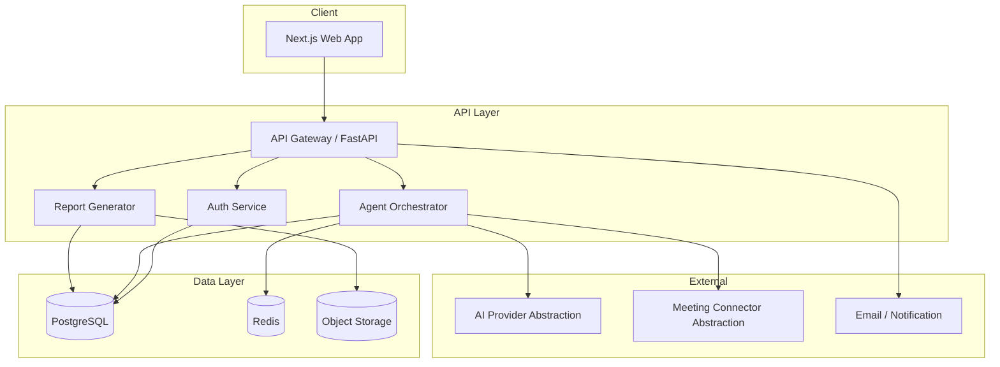
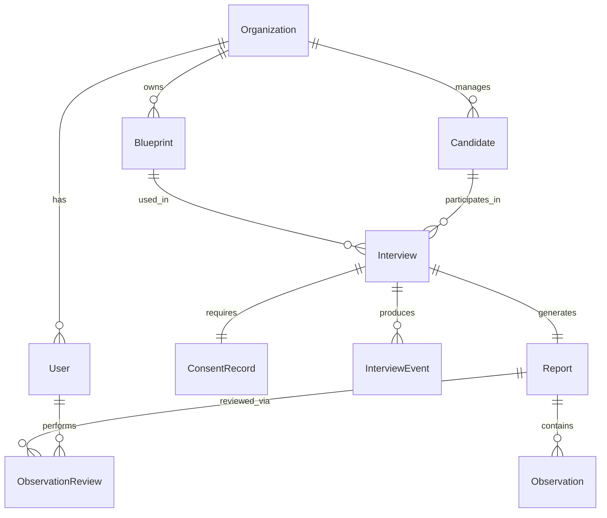
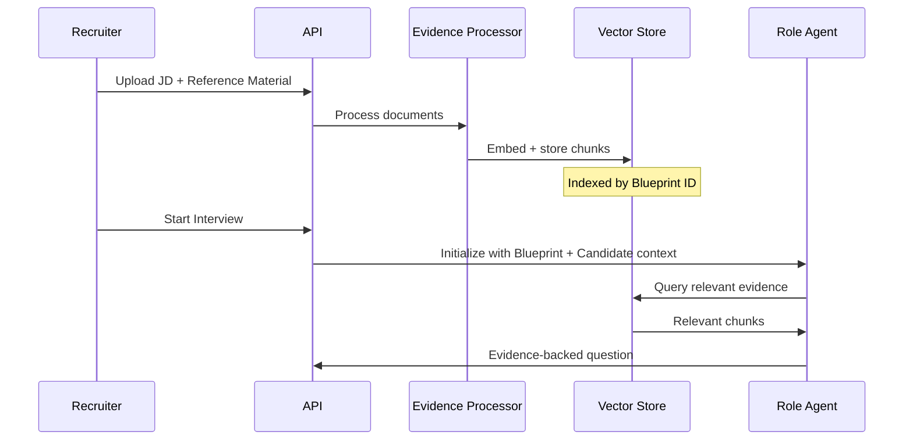
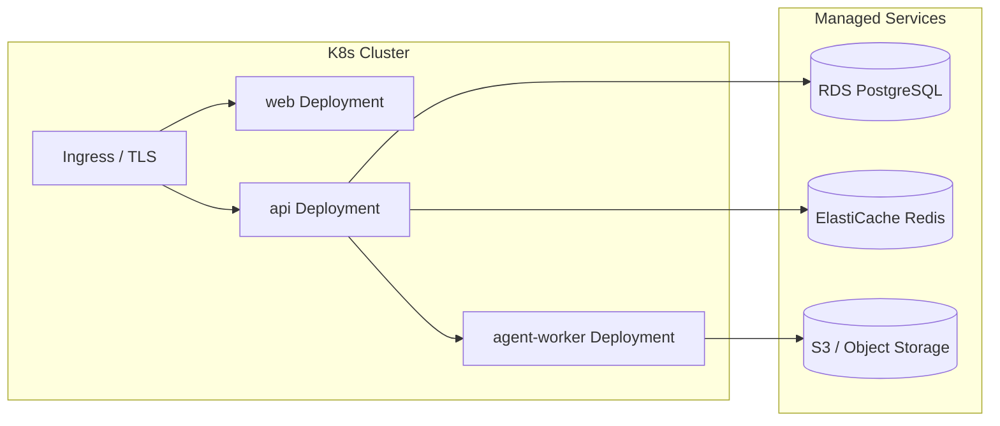

# ExpertSeat — Architecture

**Status**: Milestone 0 — Foundation only
**Date**: 2026-07-13

This document describes both the current (implemented) state and the planned architecture. Sections are clearly labeled.

---

## Current State (Milestone 0 — Implemented)

The repository establishes a monorepo with two services and shared infrastructure:

```
expertseat/
├── apps/web/         Next.js 16 (App Router, React 19, TypeScript strict, Node.js 24)
├── services/api/     FastAPI (Python 3.12)
└── infrastructure/   Docker Compose (PostgreSQL 16, Redis 7)
```

**What is running:**
- Next.js app serves a single page with ExpertSeat branding
- FastAPI app exposes `/api/v1/health/live` and `/api/v1/health/ready` endpoints
- PostgreSQL and Redis are available via Docker Compose
- Alembic migration tooling is configured (no schema yet)

**What is not yet running:**
- No auth, no users, no organizations
- No interview or report logic
- No AI model integration
- No meeting connectors

---

## Planned Architecture (Milestone 1+)

The sections below describe the intended target architecture. Nothing described here is implemented.

### System Overview



### Entity Model (Planned)



**Entity groups and planned milestones:**

| Entity Group | Planned Milestone |
|---|---|
| Organization, User | Milestone 1 |
| Blueprint, BlueprintVersion | Milestone 2 |
| Candidate, ConsentRecord | Milestone 2 |
| Interview, InterviewEvent | Milestone 3 |
| Report, Observation, ObservationReview | Milestone 3 |
| MeetingSession (video/audio) | Milestone 5 |
| AuditLog | Milestone 1 |

---

### API Structure (Planned)

All endpoints are under `/api/v1/`.

| Router | Endpoints | Milestone |
|---|---|---|
| `/health` | `GET /live`, `GET /ready` | 0 (done) |
| `/auth` | `POST /login`, `POST /logout`, `POST /refresh` | 1 |
| `/orgs` | CRUD for organizations | 1 |
| `/users` | CRUD for users within org | 1 |
| `/blueprints` | CRUD + versioning | 2 |
| `/candidates` | CRUD, consent management | 2 |
| `/interviews` | Schedule, start, end | 3 |
| `/interviews/{id}/agent` | Agent interaction endpoints | 3 |
| `/reports` | Report retrieval, review | 3 |

---

### AI Provider Abstraction (Planned, Milestone 3)

The system is designed to avoid lock-in to a single AI provider. All model calls go through a provider abstraction layer:

```python
# Planned interface — not yet implemented
class AIProvider(Protocol):
    async def complete(self, prompt: str, context: InterviewContext) -> AgentResponse: ...
    async def embed(self, text: str) -> list[float]: ...
```

Planned initial support: OpenAI and Anthropic Claude (specific models to be selected at Milestone 3 based on capability and pricing at that time). The abstraction allows swapping providers per Blueprint or per org.

---

### Meeting Connector Abstraction (Planned, Milestone 5)

Video interview integration is abstracted behind a connector interface. The interview intelligence layer must not contain any platform-specific reasoning — all Zoom, Webex, or other platform specifics belong inside the connector, not the agent.

```python
# Planned interface — not yet implemented
# All operations must be implementable for any supported meeting platform.
class MeetingConnector(Protocol):
    async def join(self, session_id: str, agent_identity: AgentIdentity) -> MeetingSession: ...
    async def leave(self, session: MeetingSession) -> None: ...
    async def receive_audio(self, session: MeetingSession) -> AsyncIterator[AudioChunk]: ...
    async def send_audio(self, session: MeetingSession, audio: AudioChunk) -> None: ...
    async def mute(self, session: MeetingSession) -> None: ...
    async def unmute(self, session: MeetingSession) -> None: ...
    async def participant_events(self, session: MeetingSession) -> AsyncIterator[ParticipantEvent]: ...
    async def waiting_room_state(self, session: MeetingSession) -> WaitingRoomState: ...
    async def health(self, session: MeetingSession) -> ConnectorHealth: ...
    async def reconnect(self, session: MeetingSession) -> MeetingSession: ...
    async def report_failure(self, session: MeetingSession, error: Exception) -> None: ...
```

Platform order (see ADR-021):
- **Zoom** — first connector, Milestone 7 (after feasibility spike in Milestone 6)
- **Webex** — possible follow-on after Zoom is stable in production; not committed
- **Google Meet** — explicitly out of scope for the initial MVP

The Role Agent joins as a disclosed, named participant and uses TTS to participate verbally (see ADR-020). A static profile image is used — no generated video avatar.

---

### Evidence Pipeline (Planned, Milestone 2–3)



---

### Org Isolation

All database rows are scoped to an `organization_id`. Every query at the API layer includes an org filter derived from the authenticated user's JWT claims. Cross-org data access is prevented at the query layer, not just the API layer.

Planned implementation:
- Row-level security (RLS) policies in PostgreSQL for defense-in-depth
- Application-level org filter on every repository query
- Audit logging for any cross-org access attempt

---

### Deployment (Planned, Milestone 9)

Target: Kubernetes on a major cloud provider (provider TBD).



---

## Key Technology Decisions

See [DECISIONS.md](./DECISIONS.md) for full context on each decision.

| Decision | Choice | Status |
|---|---|---|
| Frontend framework | Next.js 16 (App Router, React 19, Node.js 24) | Decided |
| Backend framework | FastAPI (Python 3.12) | Decided |
| ORM | SQLAlchemy 2.0 | Decided |
| Database | PostgreSQL 16 | Decided |
| Cache / queue | Redis 7 | Decided |
| Package manager (FE) | pnpm | Decided |
| Package manager (BE) | uv | Decided |
| Monorepo tooling | Simple scripts (no turborepo yet) | Decided |
| Auth approach | JWT + session tokens | Planned |
| AI provider | Abstracted (OpenAI first) | Planned |
| Meeting connector | Abstracted (Zoom first) | Planned |
| Deployment platform | Kubernetes (provider TBD) | Planned |
